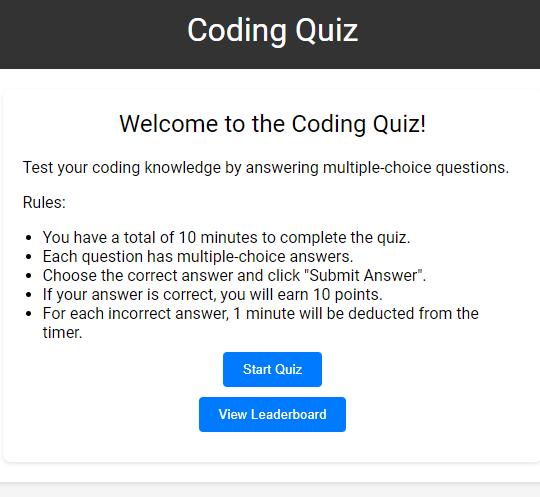

# Code-Quiz
 # Coding Quiz

Welcome to the Coding Quiz! This project is a web-based coding quiz that tests your coding knowledge through multiple-choice questions. It features a timer, score calculation, leaderboard, and more.

## Functionality

- Start Quiz: Click the "Start Quiz" button to begin the quiz. You will have a total of 10 minutes to answer the questions.

- Quiz Questions: Each question is presented one at a time. Choose the correct answer from the multiple-choice options and click "Submit Answer". If your answer is correct, you will earn 10 points. Otherwise, 1 minute will be deducted from the timer.

- Timer: The timer starts when you begin the quiz and counts down from 10 minutes. If the timer reaches 0 before you finish the quiz, the quiz will automatically end.

- Score Calculation: Your score is calculated based on the number of correct answers. At the end of the quiz, your score will be displayed as a percentage.

- Save Score: After completing the quiz, you can save your score by entering your initials and clicking "Save Score". Only one score per user is allowed. The leaderboard will show the top 10 scores.

- View Leaderboard: You can view the leaderboard by clicking the "View Leaderboard" button. It displays the initials and scores of the top 10 players.

## Technologies Used

- HTML
- CSS
- JavaScript

## Getting Started

1. Clone the repository: `git clone <repository-url>`
2. Open the `index.html` file in a web browser.

## Screenshots

<!-- 

 -->

## Contributing

Contributions are welcome! If you find any issues or have suggestions for improvement, feel free to create a pull request.

## License

This project is licensed under the MIT License. See the [LICENSE](LICENSE) file for more information.

